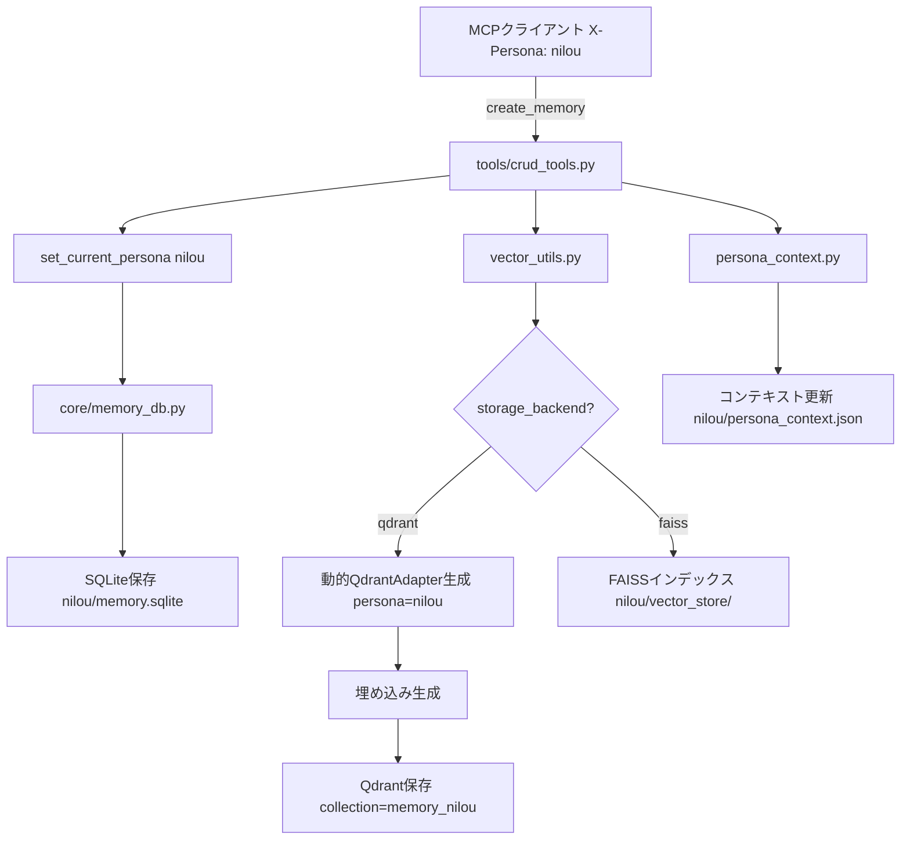
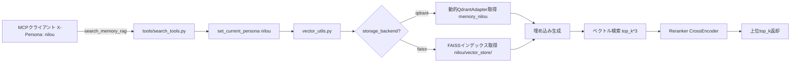

# System Patterns - アーキテクチャと設計パターン

## アーキテクチャ概要

### Phase 1リファクタリング完了
- **Before**: 2,454行の単一ファイル（memory_mcp.py）
- **After**: 231行のメインファイル + モジュール化（-90.6%）
- **設計原則**: 単一責任、依存性分離、テスタビリティ、保守性

### モジュール構成

```
memory-mcp/
├── memory_mcp.py (231行)      # MCPサーバー初期化とオーケストレーション
├── core/                       # コアロジック（MCPから独立）
│   ├── __init__.py
│   ├── memory_db.py           # SQLite CRUD操作
│   ├── persona_context.py     # Personaコンテキスト管理
│   ├── time_utils.py          # 時刻・タイムゾーン処理
│   └── __pycache__/
├── tools/                      # MCPツール定義
│   ├── __init__.py
│   ├── crud_tools.py          # Create/Read/Update/Delete
│   ├── search_tools.py        # 検索系ツール（RAG、タグ、日付）
│   ├── context_tools.py       # Personaコンテキスト操作
│   ├── analysis_tools.py      # 感情分析、関連記憶検索
│   ├── vector_tools.py        # ベクトルストア管理
│   ├── knowledge_graph_tools.py # 知識グラフ生成
│   └── __pycache__/
├── lib/                        # バックエンド実装
│   ├── backends/
│   │   ├── qdrant_backend.py  # Qdrantバックエンド（動的アダプター）
│   │   └── __pycache__/
│   └── bindings/               # フロントエンド用ライブラリ
│       └── utils.js
├── api/                        # REST APIエンドポイント（将来）
├── templates/                  # ダッシュボードUI
│   └── dashboard.html
├── data/                       # データディレクトリ
│   ├── memory/                # Personaごとのストレージ
│   │   ├── default/
│   │   │   ├── memory.sqlite  # SQLiteデータベース
│   │   │   ├── persona_context.json
│   │   │   └── vector_store/  # FAISSインデックス（FAISS mode）
│   │   ├── nilou/
│   │   └── ...
│   ├── logs/                  # ログファイル
│   │   └── memory_operations.log
│   └── cache/                 # モデルキャッシュ
│       ├── huggingface/
│       ├── sentence_transformers/
│       └── transformers/
├── config.json                # 設定ファイル（本番）
├── config.dev.json            # 設定ファイル（開発）
├── docker-compose.yml         # Docker構成
└── Dockerfile                 # Dockerイメージ定義
```

## 設計パターン

### 1. Clean Architecture
**コアロジックとMCPの分離**
- `core/`: MCPに依存しない純粋なビジネスロジック
- `tools/`: MCPツールとしてコアロジックをラップ
- `memory_mcp.py`: オーケストレーション層

**メリット**:
- テストが容易
- 他のプロトコル（REST API等）への移植が可能
- 保守性の向上

### 2. Strategy Pattern
**バックエンド切り替え**
```python
# vector_utils.py
def get_vector_store(persona: str):
    backend = config["storage_backend"]
    if backend == "qdrant":
        return create_qdrant_adapter(persona)  # 動的生成
    else:
        return FAISSBackend(persona)
```

**サポートバックエンド**:
- **FAISS**: ローカル、高速、シンプル
- **Qdrant**: スケーラブル、クラウド対応、フィルタリング強力

**Phase 24での改善**:
- グローバルvector_storeの問題を解決
- リクエスト時にペルソナ別QdrantVectorStoreAdapter動的生成
- Personaごとのコレクション（memory_default, memory_nilou等）に正確に書き込み

### 3. Context Pattern
**Personaコンテキスト管理**
```python
# persona_utils.py
current_persona: ContextVar[str] = ContextVar("current_persona", default="default")

def get_current_persona() -> str:
    return current_persona.get()

def set_current_persona(persona: str):
    current_persona.set(persona)
```

**X-Personaヘッダー**でリクエストごとにPersona切り替え（完全動的）

### 4. Repository Pattern
**データアクセス抽象化**
```python
# core/memory_db.py
def load_memory_from_db() -> Dict[str, Any]
def save_memory_to_db(key: str, content: str, tags: list, timestamp: str)
def delete_memory_from_db(key: str) -> bool
```

SQLite操作を抽象化し、将来的な他のDB移行を容易にする。

### 5. Adapter Pattern (Phase 24)
**QdrantVectorStoreAdapter**
```python
# lib/backends/qdrant_backend.py
class QdrantVectorStoreAdapter:
    def __init__(self, client, collection, embeddings, dim):
        self.client = client
        self.collection = collection  # persona別（memory_nilou等）
        self.embeddings = embeddings
        self.dim = dim
    
    def add_documents(self, texts, metadatas):
        # Personaに対応したコレクションへ書き込み
        ...
    
    def similarity_search_with_score(self, query, k):
        # Personaに対応したコレクションから検索
        ...
```

**動的生成**:
- `storage_backend == "qdrant"` の場合、リクエスト時に動的生成
- `get_current_persona()` でペルソナ取得
- ペルソナ別コレクション名（`memory_{persona}`）に書き込み

### 6. Observer Pattern (実装済み)
**イベント駆動アーキテクチャ**
- 記憶作成イベント → 感情分析トリガー（optional）
- 記憶更新イベント → Dirtyフラグセット → ベクトル再構築
- アイドル検出 → 自動整理タスク（重複検出・提案）

## データフロー

### 記憶作成フロー（Phase 24対応）


### RAG検索フロー


## コンフィグレーション

### 優先順位
1. デフォルト値（コード内）
2. 環境変数（`MEMORY_MCP_*`）
3. **config.json（最優先）**

例外: `server_host`, `server_port` は環境変数が最優先（Docker対応）

### 設定ファイル構造
```json
{
  "embeddings_model": "cl-nagoya/ruri-v3-30m",
  "embeddings_device": "cpu",
  "reranker_model": "hotchpotch/japanese-reranker-xsmall-v2",
  "reranker_top_n": 10,
  "server_host": "0.0.0.0",
  "server_port": 26262,
  "timezone": "Asia/Tokyo",
  "storage_backend": "qdrant",
  "qdrant_url": "http://nas:6333",
  "qdrant_api_key": null,
  "qdrant_collection_prefix": "memory_",
  "vector_rebuild": {
    "mode": "idle",
    "idle_seconds": 30,
    "min_interval": 120
  },
  "auto_cleanup": {
    "enabled": true,
    "idle_minutes": 30,
    "duplicate_threshold": 0.9
  }
}
```

### 開発/本番環境分離
- `config.dev.json`: 開発環境（FAISS、localhost:6333）
- `config.json`: 本番環境（Qdrant、nas:6333）

## パフォーマンス戦略

### 1. 埋め込みキャッシュ
- HuggingFaceモデルキャッシュ: `data/cache/`
- 初回起動後はローカルから読み込み

### 2. クエリキャッシュ
- `db_utils.py`: LRUキャッシュで頻繁なクエリを高速化

### 3. 非同期処理
- FastAPI/FastMCPの非同期機能を活用
- ベクトル再構築はバックグラウンドスレッド

### 4. リランキング戦略
- 初期検索: `top_k * 3` 件取得
- CrossEncoderで再スコアリング
- 上位 `top_k` 件を返却

### 5. 動的アダプター生成（Phase 24）
- Qdrantアダプターはリクエスト時のみ生成
- メモリ効率とPersona分離を両立

## セキュリティパターン

### Persona分離（Phase 24強化）
- **データベース**: Personaごとに完全に独立したSQLiteファイル（`memory/{persona}/memory.sqlite`）
- **ベクトルストア**: 
  - FAISS: Personaごとに独立したディレクトリ（`memory/{persona}/vector_store/`）
  - Qdrant: Personaごとに独立したコレクション（`memory_{persona}`）
- **コンテキスト**: Persona間でデータ混在なし
- **動的切替**: リクエストごとにX-Personaヘッダーで完全分離

### ファイルパス検証
```python
# persona_utils.py
def get_persona_dir(persona: str) -> Path:
    # パストラバーサル対策
    safe_persona = persona.replace("/", "_").replace("\\", "_")
    return MEMORY_ROOT / safe_persona
```

## エラーハンドリング

### 階層的エラー処理
1. **コア層**: 例外を発生させる（ValueError, FileNotFoundError等）
2. **ツール層**: 例外をキャッチし、ユーザーフレンドリーなメッセージに変換
3. **MCP層**: HTTPステータスコードとJSONエラーレスポンス

### ログ戦略
- `memory_operations.log`: 全操作をタイムスタンプ付きで記録（JSONL形式）
- エラーレベル: INFO（正常）、WARNING（注意）、ERROR（エラー）

## 拡張性

### プラグインアーキテクチャ（Phase 3予定）
```python
# plugins/
# ├── emotion_plugin.py
# ├── translation_plugin.py
# └── custom_search_plugin.py
```

各プラグインは標準インターフェースを実装し、動的にロード。

### バックエンド追加
新しいバックエンドは `lib/backends/` に追加し、共通インターフェースを実装：
```python
class VectorBackend(ABC):
    @abstractmethod
    def add_documents(self, texts: list, metadatas: list):
        pass
    
    @abstractmethod
    def similarity_search_with_score(self, query: str, k: int) -> list:
        pass
```

## Phase 24の成果
- ✅ グローバルvector_store問題解決（defaultペルソナ固定 → 動的切替）
- ✅ リクエスト時動的QdrantVectorStoreAdapter生成
- ✅ Personaごとのコレクション（memory_default、memory_nilou等）に正確に書き込み
- ✅ 検証完了（memory_nilouコレクション 89→90ポイント）
