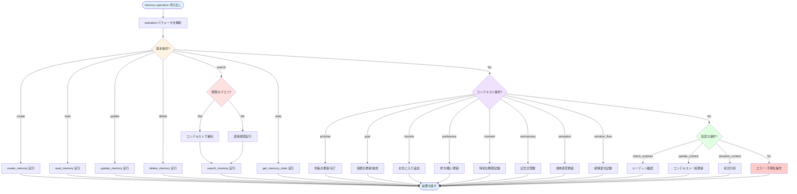
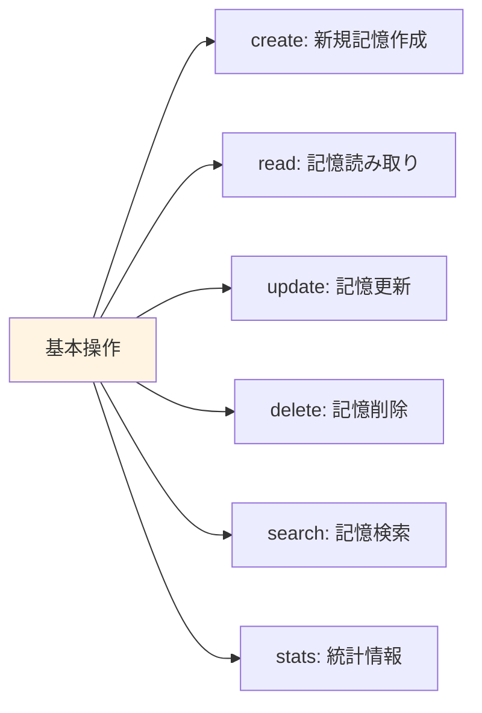
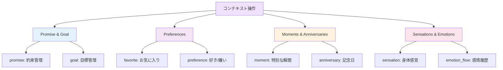
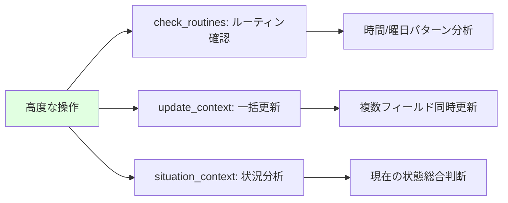
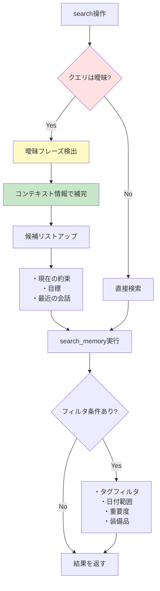
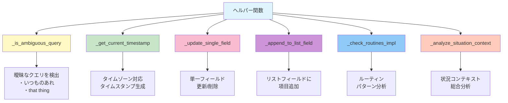
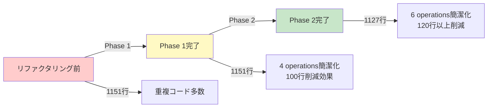

# Memory Operation Flowchart

## memory() 関数の全体フロー図

## 操作カテゴリ別詳細

### 1. 基本操作（Basic Operations）

### 2. コンテキスト操作（Context Operations）

### 3. 高度な操作（Advanced Operations）

## 検索フローの詳細

## ヘルパー関数の役割

## コード削減効果

## 主要な改善ポイント

1. **ヘルパー関数による共通処理の集約**
   - タイムスタンプ生成
   - 単一フィールド更新
   - リスト追加処理

2. **早期バリデーション**
   - パラメータチェックを最初に実行
   - エラーメッセージの明確化

3. **コードの一貫性**
   - 同じパターンは同じヘルパー関数を使用
   - 保守性の大幅向上

4. **可読性の向上**
   - 長い処理 → 短く簡潔に
   - 意図が明確になった
