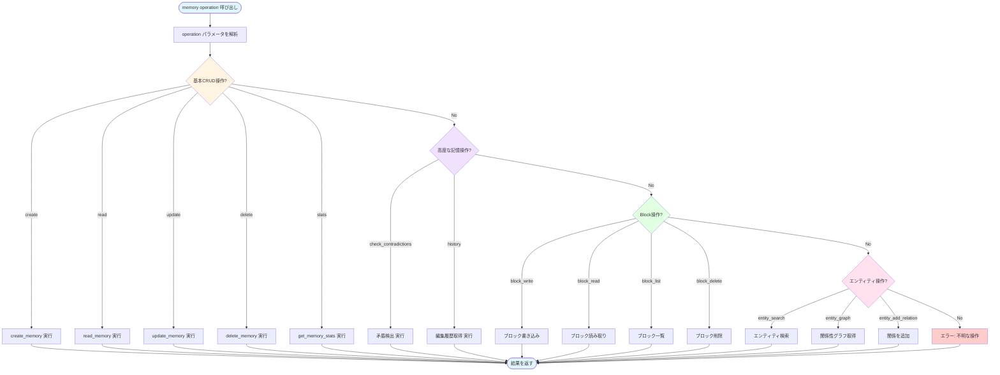
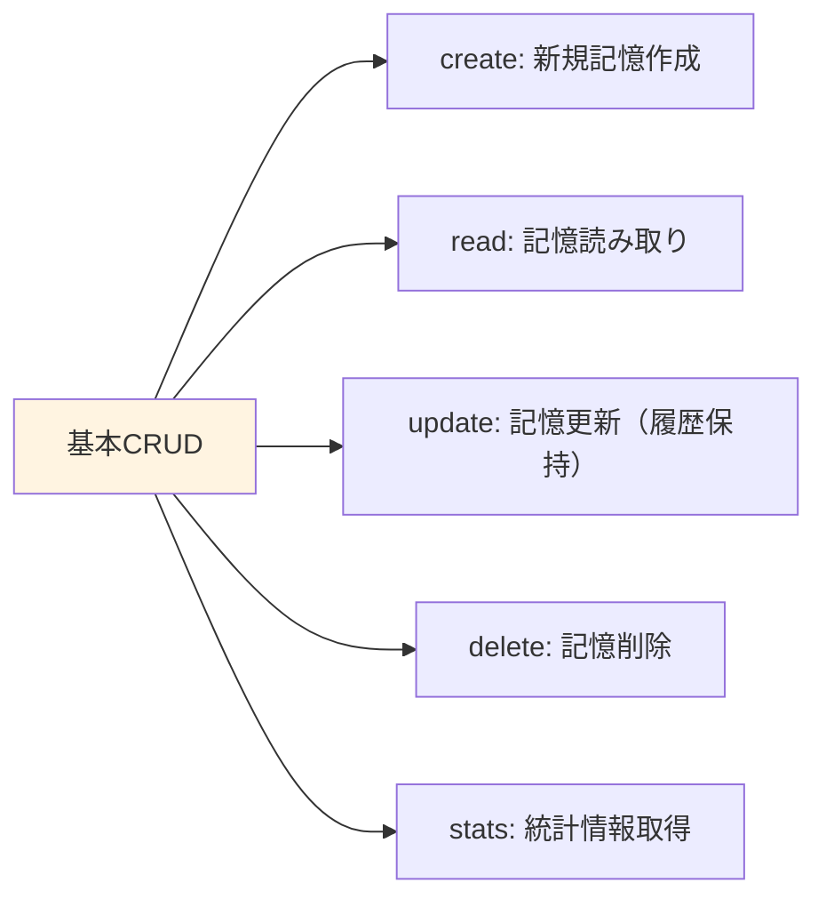
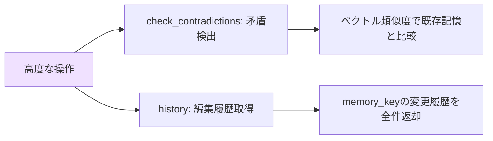
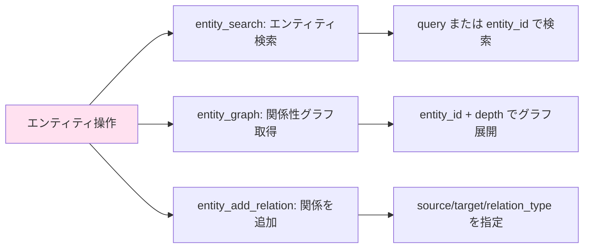

# Memory Operation Flowchart

## memory() 関数の全体フロー図


```mermaid
flowchart TD
    Start([memory operation 呼び出し]) --> Parse[operation パラメータを解析]

    Parse --> BasicOps{基本CRUD操作?}
    BasicOps -->|create| Create[create_memory 実行]
    BasicOps -->|read| Read[read_memory 実行]
    BasicOps -->|update| Update[update_memory 実行]
    BasicOps -->|delete| Delete[delete_memory 実行]
    BasicOps -->|stats| Stats[get_memory_stats 実行]

    BasicOps -->|No| AdvancedOps{高度な記憶操作?}
    AdvancedOps -->|check_contradictions| Contradict[矛盾検出 実行]
    AdvancedOps -->|history| History[編集履歴取得 実行]

    AdvancedOps -->|No| BlockOps{Block操作?}
    BlockOps -->|block_write| BlockWrite[ブロック書き込み]
    BlockOps -->|block_read| BlockRead[ブロック読み取り]
    BlockOps -->|block_list| BlockList[ブロック一覧]
    BlockOps -->|block_delete| BlockDelete[ブロック削除]

    BlockOps -->|No| EntityOps{エンティティ操作?}
    EntityOps -->|entity_search| EntitySearch[エンティティ検索]
    EntityOps -->|entity_graph| EntityGraph[関係性グラフ取得]
    EntityOps -->|entity_add_relation| EntityRelation[関係を追加]

    EntityOps -->|No| Error[エラー: 不明な操作]

    Create --> End([結果を返す])
    Read --> End
    Update --> End
    Delete --> End
    Stats --> End
    Contradict --> End
    History --> End
    BlockWrite --> End
    BlockRead --> End
    BlockList --> End
    BlockDelete --> End
    EntitySearch --> End
    EntityGraph --> End
    EntityRelation --> End
    Error --> End

    style Start fill:#e1f5ff
    style End fill:#e1f5ff
    style BasicOps fill:#fff4e1
    style AdvancedOps fill:#f0e1ff
    style BlockOps fill:#e1ffe1
    style EntityOps fill:#ffe1f0
    style Error fill:#ffcccc
```

## 操作カテゴリ別詳細

### 1. 基本CRUD操作


```mermaid
flowchart LR
    A[基本CRUD] --> B[create: 新規記憶作成]
    A --> C[read: 記憶読み取り]
    A --> D[update: 記憶更新（履歴保持）]
    A --> E[delete: 記憶削除]
    A --> F[stats: 統計情報取得]

    style A fill:#fff4e1
```

**パラメータの主要な組み合わせ:**

| operation | 必須 | 任意 |
|-----------|------|------|
| `create` | `content` | `importance`, `emotion_type`, `emotion_intensity`, `tags`, `context_tags`, `privacy_level`, `defer_vector` |
| `read` | — | `memory_key`（省略で最新10件） |
| `update` | `memory_key` | `content`, `importance`, `emotion_type`, `tags` |
| `delete` | `memory_key` または `query` | — |
| `stats` | — | — |

### 2. 高度な記憶操作


```mermaid
flowchart LR
    A[高度な操作] --> B[check_contradictions: 矛盾検出]
    A --> C[history: 編集履歴取得]

    B --> B1[ベクトル類似度で既存記憶と比較]
    C --> C1[memory_keyの変更履歴を全件返却]

    style A fill:#f0e1ff
```

**使用例:**
```python
# 既存記憶との矛盾チェック
memory(operation="check_contradictions",
       content="ユーザーはいちごが嫌い")
# → 類似した記憶との矛盾を検出・返却

# 編集履歴取得
memory(operation="history",
       memory_key="memory_20250101_120000")
```

### 3. Named Memory Blocks

```mermaid
flowchart TD
    A[Block操作] --> B[block_write: ブロック書き込み/更新]
    A --> C[block_read: ブロック読み取り]
    A --> D[block_list: 全ブロック一覧]
    A --> E[block_delete: ブロック削除]

    B --> B1[get_context()の先頭にpriority降順で注入]
    C --> C1[block_name指定でコンテンツ返却]
    D --> D1[全ブロック名・メタデータ一覧]
    E --> E1[block_name指定で削除]

    style A fill:#e1ffe1
```

**使用例:**
```python
# ブロック書き込み（最大トークン数・優先度指定可）
memory(operation="block_write",
       block_name="user_model",
       content="田中太郎、Pythonエンジニア、猫好き。",
       priority=10)

# ブロック読み取り
memory(operation="block_read", block_name="user_model")

# 全ブロック一覧
memory(operation="block_list")

# ブロック削除
memory(operation="block_delete", block_name="user_model")
```

**標準ブロック名:**

| block_name | 用途 |
|------------|------|
| `persona_state` | ペルソナの現在の内部状態・目標 |
| `user_model` | ユーザーについての推定・既知情報 |
| `active_context` | 現在のセッションの焦点・未解決の質問 |

> **Note**: ブロックは `get_context()` レスポンスの先頭に `priority` 降順で自動注入される。

### 4. エンティティグラフ操作


```mermaid
flowchart LR
    A[エンティティ操作] --> B[entity_search: エンティティ検索]
    A --> C[entity_graph: 関係性グラフ取得]
    A --> D[entity_add_relation: 関係を追加]

    B --> B1[query または entity_id で検索]
    C --> C1[entity_id + depth でグラフ展開]
    D --> D1[source/target/relation_type を指定]

    style A fill:#ffe1f0
```

**使用例:**
```python
# エンティティ検索
memory(operation="entity_search", query="田中")
memory(operation="entity_search", entity_type="person")

# 関係性グラフ取得（depth=2で2ホップ展開）
memory(operation="entity_graph",
       entity_id="user_tanaka", depth=2)

# 関係を追加
memory(operation="entity_add_relation",
       source_entity="user_tanaka",
       target_entity="company_acme",
       relation_type="works_at")
```

## 全 operation 一覧

| operation | カテゴリ | 必須パラメータ |
|-----------|---------|--------------|
| `create` | 基本CRUD | `content` |
| `read` | 基本CRUD | — |
| `update` | 基本CRUD | `memory_key` |
| `delete` | 基本CRUD | `memory_key` or `query` |
| `stats` | 基本CRUD | — |
| `check_contradictions` | 高度な操作 | `content` or `memory_key` |
| `history` | 高度な操作 | `memory_key` |
| `block_write` | Block | `block_name`, `content` |
| `block_read` | Block | `block_name` |
| `block_list` | Block | — |
| `block_delete` | Block | `block_name` |
| `entity_search` | Entity | `query` or `entity_id` |
| `entity_graph` | Entity | `entity_id` |
| `entity_add_relation` | Entity | `source_entity`, `target_entity`, `relation_type` |

> **検索は `search_memory()` ツールを使用**  
> `memory()` に `search` operation は存在しない。記憶の検索には `search_memory(query, mode, ...)` を呼ぶこと。

> **状態更新は `update_context()` ツールを使用**  
> 感情・身体状態・ユーザー情報の更新には `update_context(...)` を呼ぶこと。`memory()` の operation ではない。
